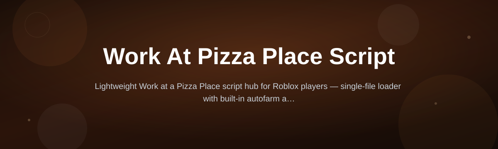

  

# pizza-place-script-hub

*A community-built script for players who are tired of doing the same kitchen click twenty times a shift.*

## What this is

**A small script started as a weekend fix for one annoying kitchen task — it turned into a hub that other players now help build.**

Read the origin story

It started because one contributor kept losing tips to a slow oven-timing routine in Work at a Pizza Place. The first version was a single file, barely fifty lines, shared with a couple of friends so they'd stop asking for it in DMs. Someone opened an issue asking for a delivery-side version. Someone else fixed a bug that only showed up on a different screen resolution. Within a few months the single file had become a folder of modules, a launcher, and a small group of people reviewing each other's pull requests. Nobody planned to run an open-source project — it just kept getting easier to maintain in the open than to keep answering the same questions in private chats. That's what this repository is now: the same script, grown up, with room for whoever wants to help it keep working.

pizza-place-script-hub is a community-maintained collection of scripts built around Work at a Pizza Place, the long-running Roblox restaurant simulation. The project's goal is narrow on purpose: reduce repetitive kitchen, counter, and delivery actions so players can spend their shift on the parts of the game that are actually fun, without staring at the same menu for an hour.

Unlike one-off scripts passed around in Discord servers, this repository is versioned, documented, and genuinely open to pull requests. Every module is written to be readable by someone new to Lua-style scripting, checked against the current game build before each release, and tagged so contributors can find a manageable first issue instead of reading the entire codebase to get oriented.

  